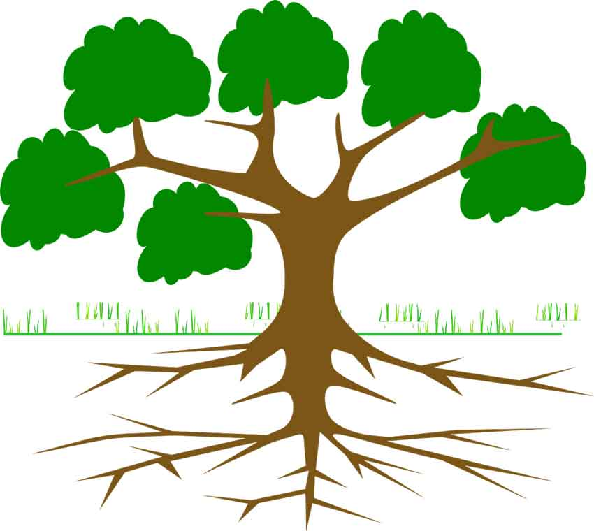

# Binary Search Trees (BST)


Binary search trees (BSTs) are a type of data structure that organizes elements in a hierarchical manner. They are called "binary" because each node in the tree has at most two children. The tree is structured in a way that makes it efficient to perform search, insertion, and deletion operations.

Here's a simple explanation of binary search trees:

**Structure**: A binary search tree consists of nodes connected in a tree-like structure. Each node contains a value and has two child nodes, referred to as the left child and the right child. The left child contains a value smaller than the parent node, while the right child contains a value greater than the parent node.

**Ordering Property**: The ordering property of a binary search tree ensures that for any given node, all the values in its left subtree are smaller, and all the values in its right subtree are greater. This property allows for efficient searching and sorting of elements. For example, if the parent has a value of 5, the left would be less than 5 and the right would be greater.

**Searching**: When searching for a value in a binary search tree, the search begins at the root node. If the value is equal to the current node's value, the search is successful. If the value is smaller, the search continues in the left subtree. If the value is greater, the search continues in the right subtree. This process is repeated recursively until the value is found or it is determined that the value does not exist in the tree.

**Insertion and Deletion**: To insert a new value into a binary search tree, it is compared with each node starting from the root, and based on the ordering property, it is recursively inserted as a left or right child. Deletion works by finding the node to be removed and replacing it with either its predecessor or successor node, ensuring that the ordering property of the tree is maintained.



Think of it as an actual tree with a root system. To get to the bottom of the system, you can take so many different routes and each one takes you to a different place. Each individual root is different, but shares similar properties throughout the tree. 


### Recursion

As mentioned in "Searching" & "Insertion and Deletion" above, trees require the use of recursion. What is recursion?
Recursion is a programming technique where a function calls itself to solve a smaller version of the same problem until the problem is solved. 


Imagine you have hands like the girl above. They are filthy!! You would probably not just was your hands once. You would "rinse and repeat". That is recursion. You call the "function" of washing hands until your hands are clean.

Recursion is scary though. If you are not careful, you could be caught in an infinite loop that continues to call itself. To prevent this we must make sure each function call is of a smaller problem. There also must then be a base case that when true, the cycle is stopped. 

## BST Common Operations

| Operation                      | What it Does                      | Smaller Problem                                               | Base Case                                  | Big O    |
|--------------------------------|-----------------------------------|---------------------------------------------------------------|--------------------------------------------|----------|
| Insert                         | Insert something to the tree      | Insert a value into either the left or right subtree          | Place to insert meaning the node is empty. | O(log n) |
| Remove                         | Remove something from the tree    | Search left tree or right tree                                | The value is found.                        | O(log n) |
| Contains                       | Check if something is in the tree | Search left or right subtree                                  | The value is found or all are empty.       | O(log n) |
| Traverse (Forward or Backward) | Visit all objects in the tree     | Traverse left or right subtree, current node, then other tree | The node is empty.                         | O(n)     |
| Height                         | Find the maximum height of tree   | Find height of left or right subtree                          | The node is empty. Return height.          | O(n)     |
| Size                           | Return the size of the tree       | Not recursive                                                 | Not recursive                              | O(1)     |
| Empty                          | Return if the tree is empty       | Not recursive                                                 | Not recursive                              | O(1)     |

## Example

Below, an unsorted list of numbers is given. Using a binary search tree, the numbers are sorted and returned. 
```csharp
var unsortedNumbers = new[] { 5, 89, 52, 11, 3, 7, 81, 63 };
BinarySearchTree sortedTree = new BinarySearchTree();

foreach (var number in unsortedNumbers)
    sortedTree.Insert(number);

var sortedNumbers = new List<int>();
foreach (var value in sortedTree)
    sortedNumbers.Add(value);

Console.WriteLine("Unsorted Numbers");
foreach (var num in unsortedNumbers) Console.Write($"{num} ");
Console.WriteLine();
Console.WriteLine("Sorted Numbers");
foreach (var num in sortedNumbers) Console.Write($"{num} ");
```

You can see there is the "Insert" method in line 5. This will be shown below. There needs to be a BinarySearchTree class and a Node class. 

**Binary Search Tree**
```csharp
using System.Collections;

public class BinarySearchTree : IEnumerable<int>
{
    private Node? _root;

    // Insert a new node at the front (i.e. the head) of the linked list.
    public void Insert(int value)
    {
        // Create new node
        Node newNode = new Node(value);
        // If the list is empty, then point both head and tail to the new node.
        if (_root is null)
            _root = newNode;
        // If the list is not empty, then only head will be affected.
        else
            _root.Insert(value);
    }
    public bool Contains(int value)
    {
        return _root != null && _root.Contains(value);
    }

    
    IEnumerator IEnumerable.GetEnumerator()
    {
        // call the generic version of the method
        return GetEnumerator();
    }

    /// Iterate forward through the BST
    public IEnumerator<int> GetEnumerator()
    {
        var numbers = new List<int>();
        TraverseForward(_root, numbers);
        foreach (var number in numbers)
        {
            yield return number;
        }
    }

    private void TraverseForward(Node? node, List<int> values)
    {
        if (node is not null)
        {
            TraverseForward(node.Left, values);
            values.Add(node.Data);
            TraverseForward(node.Right, values);
        }
    }

    // Iterate backward through the Linked List
    public IEnumerable Reverse()
    {
        var numbers = new List<int>();
        TraverseBackward(_root, numbers);
        foreach (var number in numbers)
        {
            yield return number;
        }
    }

    private void TraverseBackward(Node? node, List<int> values)
    {
        if (node is not null)
        {
            TraverseBackward(node.Right, values);
            values.Add(node.Data);
            TraverseBackward(node.Left, values);
        }
    }

    // Get the height of the tree
    public int GetHeight()
    {
        if (_root is null)
            return 0;
        return _root.GetHeight();
    }

    public override string ToString()
    {
        return "<Bst>{" + string.Join(", ", this) + "}";
    }
}
```

**Node**
```csharp
public class Node
{
    public int Data { get; set; }
    public Node? Right { get; private set; }
    public Node? Left { get; private set; }

    public Node(int data)
    {
        this.Data = data;
    }

    public void Insert(int value)
    {
        if (value < Data)
        {
            // Insert to the left
            if (Left is null)
                Left = new Node(value);
            else
                Left.Insert(value);
        }
        else if (value > Data)
        {
            // Insert to the right
            if (Right is null)
                Right = new Node(value);
            else
                Right.Insert(value);
        }
    }

    public bool Contains(int value)
    {
        if (Data == value)
            return true;
        if (Left is null)
            return false;
        if (Right is null)
            return false;
        if (Left.Contains(value))
            return true;
        if (Right.Contains(value))
            return true;

        return false;
    }

    public int GetHeight()
    {
        if (Left is null && Right is null)
            return 1;
        else if (Right is null && Left is not null)
            return Left.GetHeight() + 1;
        else if (Left is null && Right is not null)
            return Right.GetHeight() + 1;
        int leftHeight = Left.GetHeight();
        int rightHeight = Right.GetHeight();
        if (leftHeight > rightHeight)
            return leftHeight + 1;
        return rightHeight + 1;
    }
}
```

# Problem To Solve: Most Listens

Some songs are more popular than others. The company we are working for wants us sort songs based on their number of listens. 
There are many ways to do this, but use a binary search tree. Add the following songs:
* Song A by Artist S- 1234 listens
* Song B by Artist T- 8520 listens
* Song C by Artist U- 7896 listens
* Song D by Artist V- 456 listens
* Song E by Artist W- 9510 listens
* Song F by Artist X- 6384 listens
* Song G by Artist Y- 654 listens
* Song H by Artist Z- 753 listens

Hint: The order should come to be  E, B, C, F, A, H, G, D

When you are done, review the solution here: [Solution](Tree%20Solution)

[Back to Welcome](0-Welcome.md)